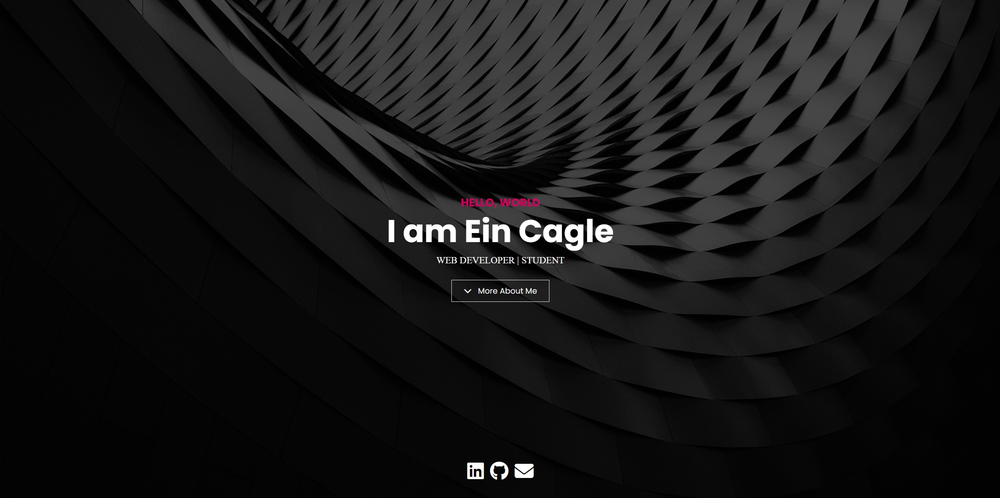

# Portfolio Website

This is a dark-light contrast website for my portfolio. It is related to being a web developer, but can be edited to be for any type of portfolio. It includes a bit of custom JavaScript for the typewriter effect and uses a script called "Lightbox" for the project modals.



## Features

- Dark and light contrast
- Responsive design
- Full height header/hero
- Background image overlays
- Typewriter effect in header
- Lightbox modals for projects
- Font awesome icons

## Usage

This website is built with [Bootstrap](https://getbootstrap.com/) and [Sass](https://sass-lang.com/). It uses [Font Awesome](https://fontawesome.com/) for icons.

In order to customize this website, you need to install [Node.js](https://nodejs.org/en/). Then, clone this repository and run:

```bash
npm install
```

This will install Bootstrap, Sass and Font Awesome. To build your CSS files from Sass, run:

```bash
npm run sass:build
```

To watch your Sass files for changes, run:

```bash
npm run sass:watch
```
